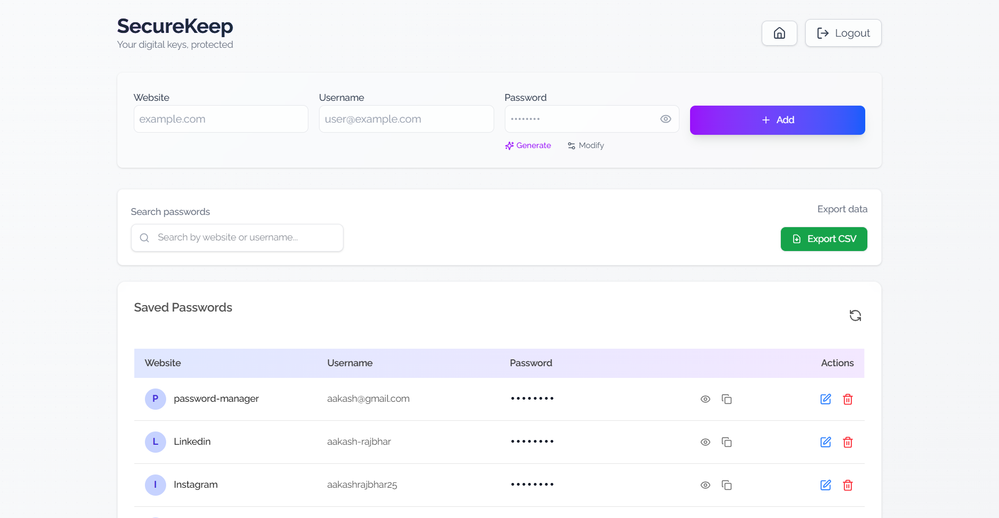

# 🔐 Secure Password Manager

A modern, full-stack password manager web app built with **Next.js**, **MongoDB**, **Tailwind CSS**, and **JWT authentication**. It allows users to securely save, view, edit, and delete their website credentials with client-triggered decryption, keeping stored passwords encrypted by default.

---

## ✨ Features

- 🔐 **Encrypted password storage** using AES-256
- 👁️ **Toggle password visibility** (client-side decryption on demand)
- ✏️ **Edit and save passwords** inline
- ➕ Add new password entries
- 🔎 Search/filter by website or username
- 📤 Export all passwords to a CSV file (with decryption warning)
- 🧾 Modern and responsive UI using Tailwind CSS
- 🔄 Refresh entries manually
- 🧠 Session-based JWT auth (token stored in `httpOnly` cookie)

---

## 🚀 Tech Stack

| Layer      | Technology                                |
| ---------- | ----------------------------------------- |
| Frontend   | React (Next.js App Router) + Tailwind CSS |
| Backend    | Node.js (API routes via Next.js)          |
| Auth       | JWT (httpOnly cookie)                     |
| Database   | MongoDB with Mongoose ORM                 |
| Encryption | AES-256 via `crypto` module               |

---

## 🛡️ Security Highlights

- All passwords are **stored encrypted** in MongoDB.
- Decryption only happens **on user request** (e.g., clicking the eye icon).
- JWT is stored as a **secure httpOnly cookie**, preventing XSS access.
- Only the owner of a password (verified via token) can view/edit/delete it.

---
